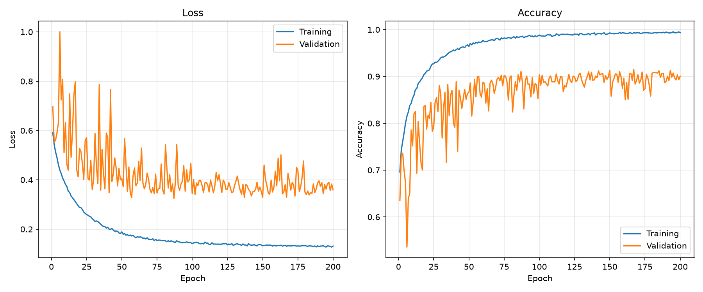
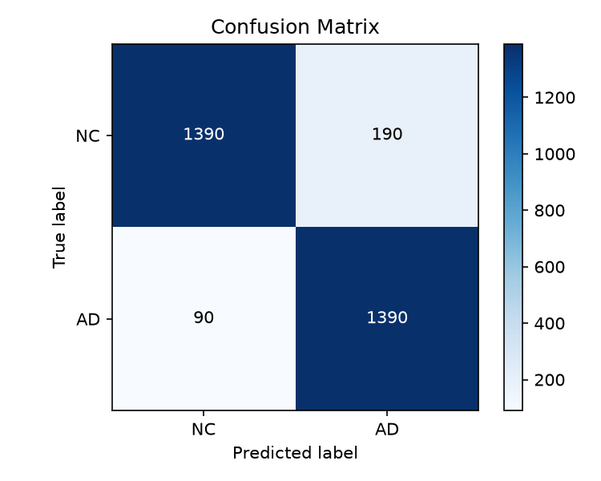
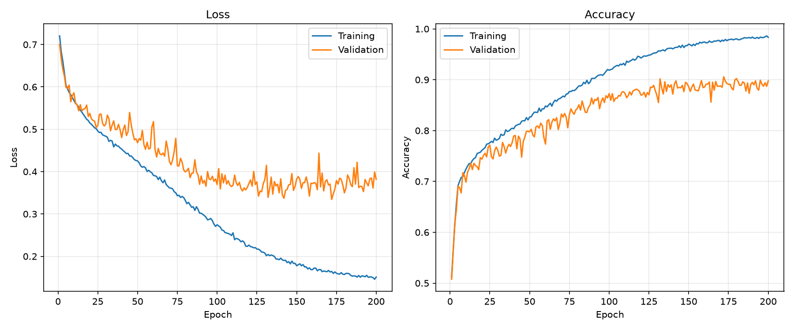
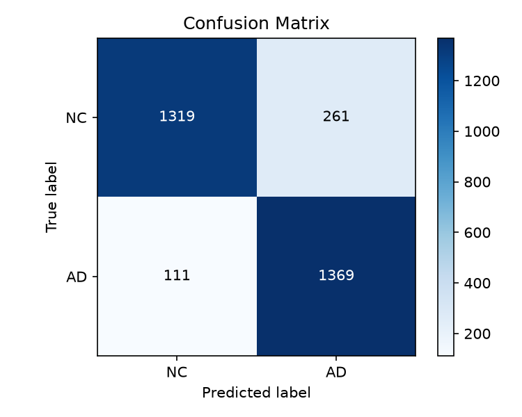
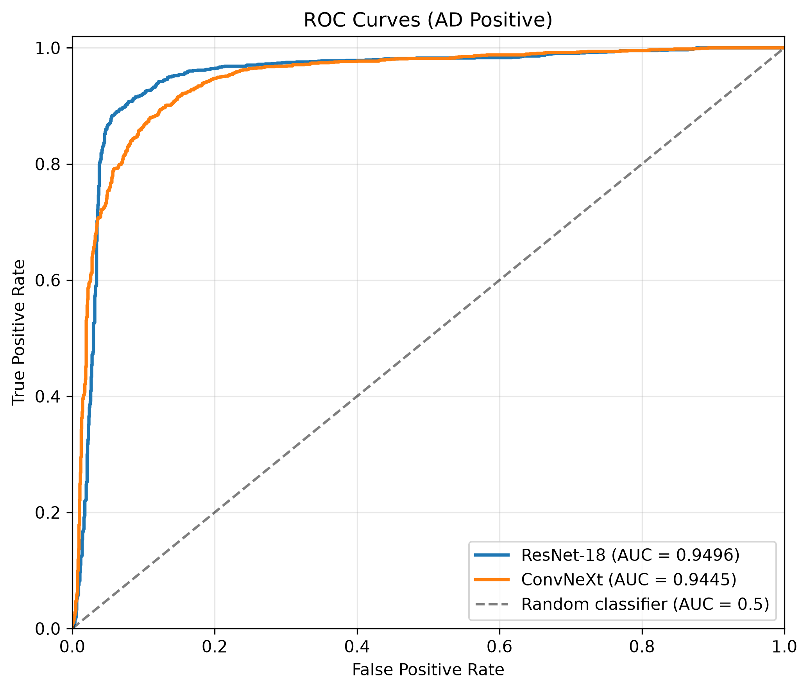
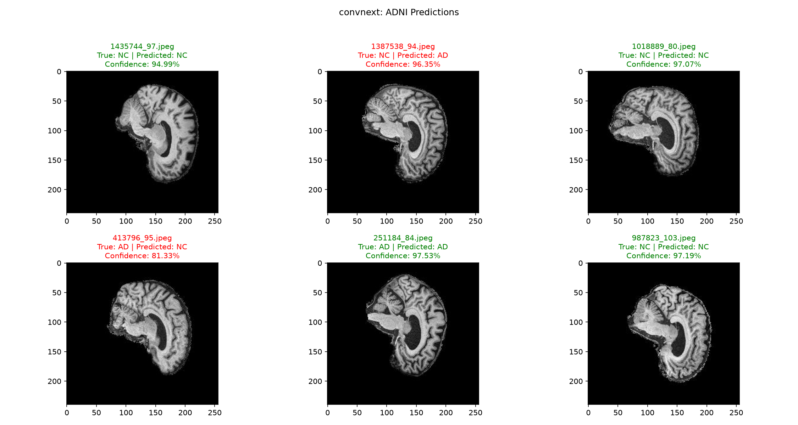

# ADNI Alzheimer's Disease Classification with ConvNeXt

## 1. Problem and Working Principles
This project implements a 2D convolutional network to classify ADNI brain MRI slices as Alzheimer's disease `AD` or cognitively normal `NC`. ConvNeXt is the main model, and ResNet-18 will provide a baseline. The engineering objective is to compare recognition performance, computational cost, and the reliability of unconfident predictions on ambiguous images that may need to be flagged for human review.

The data pipeline collects JPEG slices from the original dataset folders, groups them using the patient ID extracted from each filename, and assigns groups to approximately `70%` training, `20%` validation, and `10%` testing. Images are resized, converted to tensors, and standardised. Random augmentation is applied only to the training set to prevent overfitting. Each model learns spatial features through convolutional stages and residual connections, pools the final features, and outputs two classification logits. The epoch with the highest validation accuracy is saved for test evaluation. All reported scores describe individual slices, not aggregated patient diagnoses.

## 2. Model Architectures
### 2.1 ConvNeXt Implementation
ConvNeXt (Liu et al., 2022) improved on the ResNet architecture by modernising ResNet-50 using design ideas from Vision Transformers while mainting the simple convolutional structure of a traditional CNN.

Each block uses a `7 x 7` convolution to detect pattern in each feature channel separately. After normalisation, two linear layers mix information between channels, expanding their number by 4 and then reducing it back. GELU helps the model learn complex patterns. The result is scaled and added to the original input through a skip connection. During training, this added branch is sometimes dropped to help reduce overfitting.

| Component | Implementation | Output per image |
| --- | --- | --- |
| Input | Single channel image | `1 × 224 × 224` |
| Stem | `4 × 4` convolution, stride = 4 | `96 × 56 × 56` |
| Stage 1 | 3 blocks | `96 × 56 × 56` |
| Downsample 1 | `2 × 2` convolution = stride 2 | `192 × 28 × 28` |
| Stage 2 | 3 blocks | `192 × 28 × 28` |
| Downsample 2 | `2 × 2` convolution = stride 2 | `384 × 14 × 14` |
| Stage 3 | 9 blocks | `384 × 14 × 14` |
| Downsample 3 | `2 × 2` convolution = stride 2 | `768 × 7 × 7` |
| Stage 4 | 3 blocks | `768 × 7 × 7` |
| Pool and head | LayerNorm, dropout, linear `768 → 2` | 2 logits |

This design follows (Liu et al., 2022) configuration of `(3, 3, 9, 3)` blocks with `(96, 192, 384, 768)` channel dimensions giving approximately `27.8` million parameters. This project however changes the original design by reducing the stem to 1 input channel, adding dropout before the classification layer, and reducing the classification layer down to 2 classes.

### 2.2 ResNet-18 Implementation
ResNet-18 will provide a suitable baseline comparison for the ConvNeXt network since it was the predecessor ConvNeXt was based off. Each `ResNetBlock` contains a `3 x 3` convolution, BatchNorm and ReLU followed by another `3 x 3` convolution and BatchNorm. The output is added to a skip connection and passed through ReLU. This allows the block to learn a residual corecction while preserving a direct path for information and gradients.

| Component | Implementation | Output per image |
| --- | --- | --- |
| Input | Single channel image | `1 × 224 × 224` |
| Stem convolution | `7 × 7`, stride = 2 | `64 × 112 × 112` |
| Max pooling | `3 × 3`, stride = 2, padding = 1 | `64 × 56 × 56` |
| Stage 1 | 2 residual blocks, 64 channels | `64 × 56 × 56` |
| Stage 2 | 2 blocks | `128 × 28 × 28` |
| Stage 3 | 2 blocks | `256 × 14 × 14` |
| Stage 4 | 2 blocks | `512 × 7 × 7` |
| Pool and head | Adaptive average pool to `1 × 1`, linear `512 → 2` | 2 logits |

This design differs from the original (He et al., 2015) ResNet architecture by using a single input channel stem, adaptive global pooling and a 2 output classification layer. This gave a configuration of `(2, 2, 2, 2)` blocks with `(64, 128, 256, 512)` channel dimensions providing approximately `11.2` million parameters.

## 3. Dataset Preprocessing
### 3.1 Patient Splitting
The original provided ADNI dataset had patient leakage across the training and test sets. To fix this the original dataset was pooled together and resplit by patient ID provided by the images file names.

The filenames for example, `388206_78.jpeg` provided the patient ID `388206` and the slice index `78`. To avoid patient leakage, all slices were placed in the same split with their associated patient. To accomplish this, the `1526` unique patients were split into `70%` training, `20%` validation, and `10%` testing, then the images were assigned to the split of their corresponding patient ID.

This resulted the following splits below:

| Dataset Split | Total Images | Percentage | Subjects | NC Images | AD Images |
| ------------- | ------------ | ---------- | -------- | --------- | --------- |
| Train         | 21,360       | 69.99%     | 1,068    | 10,960    | 10,400    |
| Validation    | 6,100        | 19.99%     | 305      | 3,120     | 2,980     |
| Test          | 3,060        | 10.03%     | 153      | 1,580     | 1,480     |
| Total         | 30,520       | 100%       | 1,526    | 15,660    | 14,860    |

The dataset is approximately balanced with `NC` and `AD` nearly having equal class proportions.

### 3.2 Preprocessing Images
| Step                                                           | Reason                                                                                                              |
| -------------------------------------------------------------- | ------------------------------------------------------------------------------------------------------------------- |
| Resize to `224 x 224`                                          | All images in dataset are currently `256 x 240`. The standard ConvNeXt and Resnet designs used `224 x 224` images.  |
| Scale Pixel Values to `[0, 1]`                                 | Current pixel values are [0, 255], helps model training by avoiding large activations and gradients.                |
| Standardising using mean `0.1160`, standard deviation `0.2230` | Makes training set approximately mean `0` and standard deviation `1`.                                               |

All images are normalised using mean `0.1160` and standard deviation `0.2230` by: `x_normalised = (x - 0.1160) / 0.2230`. This mean and standard deviation was calculated using the training set and applied to training, validation, and test images. 

### 3.3 Dataset Augmentation
Both models suffered from overfitting to the training set quickly reaching `100%` training accuracy, to fix this a significant amount of data augmentation was needed to prevent the models from memorising the training images. The following random augmentation are applied to training images and reapplied each epoch. Validation and testing images used only the deterministic preprocessing described in section `3.2`.

| Augmentation | Parameters | Intended Effect |
| --- | --- | --- |
| Resize | `256 × 256` | Standardises the images before random cropping. |
| Random resized crop | Output `224 × 224`, area fraction `0.9–1.0`, aspect ratio `0.9–1.1` | Varies framing and scale, however can potentially remove anatomy |
| Horizontal flip | Probability `0.5` | Encourages robustness to left and right orientation changes. |
| Random affine | Rotation `±15°`, horizontal/vertical translation up to `10%`, scale `0.9–1.0` | Varies the position of the brain in the image, however can potentially remove anatomy. |
| Brightness/contrast jitter | Brightness `±0.1`, contrast `±0.15`, | Reduces dependence on intensity appearance. |
| Gaussian blur | Kernel `3 × 3`; sigma `0.1–1.0` | Varies sharpness of images, helps with potential differences in scan quality. |

Augmentation expands the appearances observed during learning without adding more patients. This helped the model generalise improving validation accuracy.

## 4. Hyperparameters and Training Methodology


### 4.1 Configuration

| Parameter | Value |
| --- | --- |
| Initialization | Random weights |
| Epochs | 200 |
| Batch size | 64 |
| Optimizer | AdamW |
| Initial learning rate | `1e-3` |
| Weight decay | `1e-4` |
| Loss | `CrossEntropyLoss(label_smoothing=0.05)` |
| Learning rate schedule | 5 epoch linear warmup, then cosine decay toward `1e-6` |
| Checkpoint selection | Highest validation accuracy |
| Random seed | 42 |
| DataLoader workers | 4 |

Validation is run at the end of every epoch where the highest validation accuracy is the model saved. This was to ensure the highest accuracy model was saved even if the models performancce degraded afterwards due to overfitting. `200` epochs were used to allow training time for the model to properly converge. A small batch size of `64` was chosen to lower memory usage and use the stochastic noise during gradient calculations to potentially help the model escape poor local minima.

### 4.2 Regularisation
- ConvNeXt uses `30%` dropout to prevent co-adaptation.
- ConvNext uses `10%` drop path for stochastic depth regularisation.
- Cross Entropy Loss Label smoothing to reduce over confidence.
### 4.3 Learning Rate Schedule
A combination of a linear warmup and cosine annealing was used to change learning rate during training. For the first `5` epochs the learning rate linearly increases up to the inital learning rate of `1e-3`. Then over the next `195` epochs, cosine annealing is used to progressively reduce the learning rate to `1e-6`. This helps the model achieve smooth convergence in late epoch learning as the gradient steps will be smaller.


## 5. ResNet-18 Model Results

For these results, both models were trained using a Nvidia A100 GPU. The test metrics were evaluated using the `10%` testing split.

### 5.1 Training History
The model was trained for `200` epochs which took approximately `132` minutes and `39.61` seconds per epoch. The training loss and accuracy history plots are shown below.



The model saved was from epoch `167` which achieved the highest validation accuracy of `91.51%` indiciating the model is capable of generalising to unseen data. As displayed in figure (), ResNet-18 demonstrated strong learning performance steadily increasing to `99.36%` training accuracy. However, validation accuracy plateus at approximately `89-90%` after 100 epochs. This widening gap between training and validation performance indicates overfitting.


### 5.2 Test Results
The final model was evaluated on the hold out test set. The confusion matrix and test metrics below shows the model's performance on this unseen data.




| Metric | ResNet-18 |
| --- | --- |
| Accuracy | **90.85%** 
| F1 | **90.85%** |
| ROC-AUC | **94.96%** |

The model achieved strong performance on the test set, with an accuracy of `90.85%`, F1-score of `90.85%` and ROC-AUC of `94.96%`. Importantly, the model achieved an AD recall (sensitivity) of `93.92%` indicating that it successfully identified the majority of Alzheimer's cases.

The higher number of false positive to false negatives is prefereble in the context of Alzheimer's screening, where failing to identify a potential case may have more serious consequences than incorrectly flagging a healthy individual, who can undergo further diagnostic testing to correct the mistake.

## 6. ConvNeXt Model Results
### 6.1 Training History
The model was trained for `200` epochs which took approximately `135` minutes and `39.78` seconds per epoch. The training loss and accuracy history plots are shown below.



The model saved was from epoch `172` which achieved the highest validation accuracy of `90.57%`. Compared to ResNet-18, ConvNeXt demonstrates smoother validation performance following closely to training accuracy during earlier epochs. However, validation accuracy begins to plateu around epoch `130` were it again begins to clearly show signs of overfitting.

### 6.2 Test Results


| Metric | ResNet-18 |
| --- | --- |
| Accuracy | **87.84%** 
| F1 | **88.04%** |
| ROC-AUC | **94.45%** |

ConvNeXt achieved strong performance on the test set, with an accuracy of `87.84%`, F1-score of `88.04%` and ROC-AUC of `94.45%`. The confusion matrix shows it correctly identified less NC and AD images compared to ResNet. The model achieved a lower AD recall (sensitivity) of `92.50%` meaning ConvNeXt missed more true postives compared to ResNet.

This sensitivity still shows the model is effective at identifying the majority of Alzheimer's cases but it misses an additional `21` AD images compared to ResNet. These false negatives may lead a potential early case of Alzheimer's to go un-noticed. 

## 7. Analysis of Results
### 7.1 Why Sensitivity Matters
High sensitivity is particularly important for this Alzheimer's disease classification task because the primary objective is to identify as many individuals with the disease as possible while minimising false negatives. A false negative means potentially delaying treatment, and early intervention. In contrast, a false positive may cause uncessary anxiety and additional diagnostic testing, this error can be investigated and corrected through further clinical assessments.

Therefore, the consequence of missing a true Alzheimer's case is more significant than incorrectly flagging a healthy individual for further investigation.

### 7.2 Comparison of Model Results
Comparing the performance of both models, ResNet-18 outperformed ConvNeXt across all evaluated test metrics, achieving higher acurracy, F1-score, and ROC-AUC.



The ROC curves display that both models can strongly discriminate between classes with ResNet-18 generally achieving higher sensitivity at low false positive rates, making it more effective at identifying Alzheimer's disease cases while limiting incorrect classifications of normal cognitive images.

Importantly, ResNet-18 achieved a higher sensitivity, resulting in only `90` false negatives compared to ConvNeXt's `111`. This means ResNet-18 missed `21` fewer AD images, while also producing `71` fewer false positives.

### 7.3 Comparison of Model Computational Efficiency
To measure the difference in inference time and GPU VRAM usage, both models ran inference on the same image from the test set, and only started measuring after the dataset loading and preprocessing was complete.


| Model     | Inference Time | Peak VRAM Usage |
| --------- | -------------- | --------------- |
| ResNet-18 | 0.1521s        | 74.86 MB        |
| ConvNeXt  | 0.2999s        | 154.38 MB       |

From the table it can be seen that both models ran inference on the same test image in less than half a second. ConvNeXt used over twice the amount of VRAM compared to ResNet-18, however this is still easily within the available VRAM of most modern devices. 

This shows that both models can be used in a clinical setting on a modern device, and recieve results quickly. ResNet-18 however, is able to run inference faster and with less VRAM.

### 7.4 Final Result

Due to ResNet-18 performing better on the hold out test set, and requiring less computational resources, **ResNet-18 is clearly the better performing model for this task**.

## 8. Usage Instructions
### 8.1 Environment Setup
First clone repository and install dependencies:
```bash
git clone https://github.com/marchchris/PatternAnalysis-2026.git
cd PatternAnalysis-2026/recognition/ConvNeXt_48900353
pip install -r requirements.txt
```

### 8.2 Training
Run training with the default configuration using:

```bash
python train.py
```

The training configuration can be changed with optional command-line arguments:

```bash
python train.py --model-name resnet18 --seed [SEED] --epochs [EPOCHS] --batch-size [BATCH SIZE] --learning-rate [LEARNING RATE] --weight-decay [WEIGHT DECAY] --warmup-epochs [NUM WARMUP EPOCHS] --num-workers [NUMB LOADER WORKERS]
```

| Optional argument | Description | Default |
| --- | --- | --- |
| `--model-name` | Model architecture to train | `resnet18` or `convnext` |
| `--seed` | Random seed | `42` |
| `--epochs` | Number of training epochs | `200` |
| `--batch-size` | Number of images per batch | `64` |
| `--learning-rate` | Initial learning rate | `0.001` |
| `--weight-decay` | AdamW weight decay | `0.0001` |
| `--warmup-epochs` | Number of linear warmup epochs | `5` |
| `--num-workers` | Number of DataLoader worker processes | `4` |

Each run creates its own `Models/<model-name>/<model-name>_<timestamp>/` directory and stores `<model-name>.pth`, `training_history.png`, `confusion_matrix.png`, and `test_report.txt.` The saved weights correspond to the highest validation accuracy, which may occur before epoch 200.

An example of `test_report.txt` is:
```
Model Training Report:
Training time: 135m 22s
Average time per epoch: 39.78s

Test Set Evaluation Report:
Test loss: 0.3994
Accuracy: 0.8784
Precision (AD positive): 0.8399
Recall (AD positive): 0.9250
F1 Score (AD positive): 0.8804
ROC AUC: 0.9445
Support: 3060
Negative support: 1580
Positive support: 1480
```

### 8.3 Running Predictions

Run predictions using a saved model checkpoint with:

```bash
python predict.py --model convnext --weights Models/convnext/convnext_[TIMESTAMP]/convnext.pth
```

By default, the script selects `9` images from the test split, prints the
prediction details for each image, and saves a prediction visualisation to
`Inferences/predictions_[TIMESTAMP].png`. A different number of test images can
be selected with:

```bash
python predict.py --model resnet18 --weights Models/resnet18/resnet18_[TIMESTAMP]/resnet18.pth --num-images 12
```

An individual image can be supplied instead of sampling from the test split:

```bash
python predict.py --model convnext --weights Models/convnext/convnext_[TIMESTAMP]/convnext.pth --image path/to/image.jpeg
```

| Optional argument | Description | Default |
| --- | --- | --- |
| `--image` | Path to one image to predict instead of sampling test images | Test split |
| `--num-images` | Number of test images to sample when `--image` is not supplied | `9` |
| `--dataset-root` | Path to the ADNI dataset root | `~/Documents/Datasets/ADNI/AD_NC` |
| `--output` | Output path for the prediction visualisation | `Inferences/predictions.png` |

The required arguments are:

| Required argument | Description |
| --- | --- |
| `--model` | Model architecture used by the checkpoint: `resnet18` or `convnext` |
| `--weights` | Path to the saved `.pth` model checkpoint |

For every prediction, the script prints the predicted class, confidence,
class probabilities, prediction time, and peak VRAM usage. Prediction timing
and VRAM usage are measured during model evaluation after the image has been
loaded and preprocessed.

An example of the prediction visualisation saved from the trained ConvNeXt model:



## 9. Project Structure
```
PatternAnalysis-2026/recognition/
└── ConvNeXt_48900353/
    ├── dataset.py
    ├── modules.py
    ├── train.py
    ├── predict.py
    ├── requirements.txt
    ├── images/
    │   ├── 
    │   └── 
    └── README.md
```

## References
- 1. Liu, Z., Mao, H., Wu, C.-Y., Feichtenhofer, C., Darrell, T., Xie, S., Facebook, A., & Research. (2022). A ConvNet for the 2020s. https://arxiv.org/pdf/2201.03545
- 2. He, K., Zhang, X., Ren, S., & Sun, J. (2015, December 10). Deep residual learning for image recognition. arXiv. arXiv.Org. https://arxiv.org/abs/1512.03385


## AI Usage Statement
- Chat GPT 6 was used for assisting with markdown syntax, table creation, and refinement of wording in the README, all actual content and information was written by myself.
- Github Copilot (Chat GPT 5.6) was used to assist in writing code documentation and comments, and minor code refactoring. All data loading, preprocessing, training and analysis code was written by myself.
