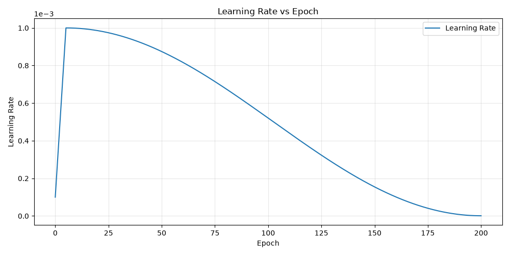

# ADNI Alzheimer's Disease Classification with ConvNeXt

## 1. Problem and Working Principles
This project implements a 2D convolutional network to classify ADNI brain MRI slices as Alzheimer's disease `AD` or cognitively normal `NC`. ConvNeXt is the main model, and ResNet-18 will provide a baseline. The engineering objective is to compare recognition performance, computational cost, and the reliability of unconfident predictions on ambiguous images that may need to be flagged for human review.

The data pipeline collects JPEG slices from the original dataset folders, groups them using the patient ID extracted from each filename, and assigns groups to approximately `70%` training, `20%` validation, and `10%` testing. Images are resized, converted to tensors, and standardised. Random augmentation is applied only to the training set to prevent overfitting. Each model learns spatial features through convolutional stages and residual connections, pools the final features, and outputs two classification logits. The epoch with the highest validation accuracy is saved for test evaluation. All reported scores describe individual slices, not aggregated patient diagnoses.

## 2. Model Architectures
### 2.1 ConvNeXt Implementation
ConvNeXt (Liu et al., 2022) improved on the ResNet architecture by modernising ResNet-50 using design ideas from Vision Transformers while mainting the simple convolutional structure of a traditional CNN.

Each block uses a `7 x 7` convolution to detect pattern in each feature channel separately. After normalisation, two linear layers mix information between channels, expanding their number by 4 and then reducing it back. GELU helps the model learn complex patterns. The result is scaled and added to the original input through a skip connection. During training, this added branch is sometimes dropped to help reduce overfitting.

| Component | Implementation | Output per image |
| --- | --- | --- |
| Input | Single channel image | `1 × 224 × 224` |
| Stem | `4 × 4` convolution, stride = 4 | `96 × 56 × 56` |
| Stage 1 | 3 blocks | `96 × 56 × 56` |
| Downsample 1 | `2 × 2` convolution = stride 2 | `192 × 28 × 28` |
| Stage 2 | 3 blocks | `192 × 28 × 28` |
| Downsample 2 | `2 × 2` convolution = stride 2 | `384 × 14 × 14` |
| Stage 3 | 9 blocks | `384 × 14 × 14` |
| Downsample 3 | `2 × 2` convolution = stride 2 | `768 × 7 × 7` |
| Stage 4 | 3 blocks | `768 × 7 × 7` |
| Pool and head | LayerNorm, dropout, linear `768 → 2` | 2 logits |

This design follows (Liu et al., 2022) configuration of `(3, 3, 9, 3)` blocks with `(96, 192, 384, 768)` channel dimensions giving approximately `27.8` million parameters. This project however changes the original design by reducing the stem to 1 input channel, adding dropout before the classification layer, and reducing the classification layer down to 2 classes.

### 2.2 ResNet-18 Implementation
ResNet-18 will provide a suitable baseline comparison for the ConvNeXt network since it was the predecessor ConvNeXt was based off. Each `ResNetBlock` contains a `3 x 3` convolution, BatchNorm and ReLU followed by another `3 x 3` convolution and BatchNorm. The output is added to a skip connection and passed through ReLU. This allows the block to learn a residual corecction while preserving a direct path for information and gradients.

| Component | Implementation | Output per image |
| --- | --- | --- |
| Input | Single channel image | `1 × 224 × 224` |
| Stem convolution | `7 × 7`, stride = 2 | `64 × 112 × 112` |
| Max pooling | `3 × 3`, stride = 2, padding = 1 | `64 × 56 × 56` |
| Stage 1 | 2 residual blocks, 64 channels | `64 × 56 × 56` |
| Stage 2 | 2 blocks | `128 × 28 × 28` |
| Stage 3 | 2 blocks | `256 × 14 × 14` |
| Stage 4 | 2 blocks | `512 × 7 × 7` |
| Pool and head | Adaptive average pool to `1 × 1`, linear `512 → 2` | 2 logits |

This design differs from the original (He et al., 2015) ResNet architecture by using a single input channel stem, adaptive global pooling and a 2 output classification layer. This gave a configuration of `(2, 2, 2, 2)` blocks with `(64, 128, 256, 512)` channel dimensions providing approximately `11.2` million parameters.

## 3. Dataset Preprocessing
### 3.1 Patient Splitting
The original provided ADNI dataset had patient leakage across the training and test sets. To fix this the original dataset was pooled together and resplit by patient ID provided by the images file names.

The filenames for example, `388206_78.jpeg` provided the patient ID `388206` and the slice index `78`. To avoid patient leakage, all slices were placed in the same split with their associated patient. To accomplish this, the `1526` unique patients were split into `70%` training, `20%` validation, and `10%` testing, then the images were assigned to the split of their corresponding patient ID.

This resulted the following splits below:

| Dataset Split | Total Images | Percentage | Subjects | NC Images | AD Images |
| ------------- | ------------ | ---------- | -------- | --------- | --------- |
| Train         | 21,360       | 69.99%     | 1,068    | 10,960    | 10,400    |
| Validation    | 6,100        | 19.99%     | 305      | 3,120     | 2,980     |
| Test          | 3,060        | 10.03%     | 153      | 1,580     | 1,480     |
| Total         | 30,520       | 100%       | 1,526    | 15,660    | 14,860    |

The dataset is approximately balanced with `NC` and `AD` nearly having equal class proportions.

### 3.2 Preprocessing Images
| Step                                                           | Reason                                                                                                              |
| -------------------------------------------------------------- | ------------------------------------------------------------------------------------------------------------------- |
| Resize to `224 x 224`                                          | All images in dataset are currently `256 x 240`. The standard ConvNeXt and Resnet designs used `224 x 224` images.  |
| Scale Pixel Values to `[0, 1]`                                 | Current pixel values are [0, 255], helps model training by avoiding large activations and gradients.                |
| Standardising using mean `0.1160`, standard deviation `0.2230` | Makes training set approximately mean `0` and standard deviation `1`.                                               |

All images are normalised using mean `0.1160` and standard deviation `0.2230` by: `x_normalised = (x - 0.1160) / 0.2230`. This mean and standard deviation was calculated using the training set and applied to training, validation, and test images. 

### 3.3 Dataset Augmentation
Both models suffered from overfitting to the training set quickly reaching `100%` training accuracy, to fix this a significant amount of data augmentation was needed to prevent the models from memorising the training images. The following random augmentation are applied to training images and reapplied each epoch. Validation and testing images used only the deterministic preprocessing described in section `3.2`.

| Augmentation | Parameters | Intended Effect |
| --- | --- | --- |
| Resize | `256 × 256` | Standardises the images before random cropping. |
| Random resized crop | Output `224 × 224`, area fraction `0.9–1.0`, aspect ratio `0.9–1.1` | Varies framing and scale, however can potentially remove anatomy |
| Horizontal flip | Probability `0.5` | Encourages robustness to left and right orientation changes. |
| Random affine | Rotation `±15°`, horizontal/vertical translation up to `10%`, scale `0.9–1.0` | Varies the position of the brain in the image, however can potentially remove anatomy. |
| Brightness/contrast jitter | Brightness `±0.1`, contrast `±0.15`, | Reduces dependence on intensity appearance. |
| Gaussian blur | Kernel `3 × 3`; sigma `0.1–1.0` | Varies sharpness of images, helps with potential differences in scan quality. |

Augmentation expands the appearances observed during learning without adding more patients. This helped the model generalise improving validation accuracy.

## 4. Hyperparameters and Training Methodology

### 4.1 Configuration

| Parameter | Value |
| --- | --- |
| Initialization | Random weights |
| Epochs | 200 |
| Batch size | 64 |
| Optimizer | AdamW |
| Initial learning rate | `1e-3` |
| Weight decay | `1e-4` |
| Loss | `CrossEntropyLoss(label_smoothing=0.05)` |
| Learning rate schedule | 5 epoch linear warmup, then cosine decay toward `1e-6` |
| Checkpoint selection | Highest validation accuracy |
| Random seed | 42 |
| DataLoader workers | 4 |

### 4.2 Regularisation
- ConvNeXt uses 30% dropout to prevent co-adaptation.
- Cross Entropy Loss Label smoothing to reduce overconfidence.
- The highest validation accuracy epoch is saved even if the model continues training. This prevents the models performance degrading due to overfitting.

### 4.3 Learning Rate Schedule
A combination of a linear warmup and cosine annealing was used to change learning rate during training. For the first `5` epochs the learning rate linearly increases up to the inital learning rate of `1e-3`. Then over the next `195` epochs, cosine annealing is used to progressively reduce the learning rate to `1e-6`. This helps the model achieve smooth convergence in late epoch learning as the gradient steps will be smaller.

## References
- 1. Liu, Z., Mao, H., Wu, C.-Y., Feichtenhofer, C., Darrell, T., Xie, S., Facebook, A., & Research. (2022). A ConvNet for the 2020s. https://arxiv.org/pdf/2201.03545
- 2. He, K., Zhang, X., Ren, S., & Sun, J. (2015, December 10). Deep residual learning for image recognition. arXiv. arXiv.Org. https://arxiv.org/abs/1512.03385
- 3. COMP3710 Teaching Team. (2026, August 26). Lab Demonstration 2 Pattern Recognition [PDF]. https://learn.uq.edu.au/ultra/courses/_206498_1/document/_14338370_1?view=content&state=view

## AI Usage Statement
- Chat GPT 6 was used for assisting with markdown syntax, table creation, and refinement of wording in the README, all actual content and information was written by myself.
- Github Copilot (Chat GPT 5.6) was used to assist in writing code documentation and comments, and minor code refactoring. All data loading, preprocessing, training and analysis code was written by myself.
