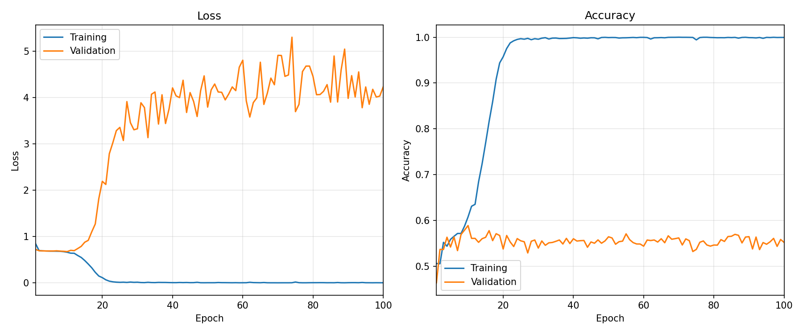
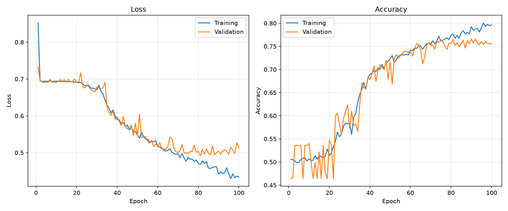

# ADNI MRI Classifcation

## 1. Feasibility Review

### User Need and Scope
The intended user this project is aimed towards is a researcher evaluating a machine learning model that could assist human reviewers in diagnosing Alzheimer's disease from MRI images. The project scope is limited to training and evaluating the models on the course-provided 2D ADNI MRI images, it will not combine multiple brain slices from the same patient to produce a prediction.

### Acceptance Criteria
1. Every included ADNI image has a valid mapping to a patient, and the training, validation, and testing set has no patient leakage.
2. ConvNeXt achieves a test accuracy of atleast `80%`.
3. The ConvNeXt model achieves a higher test accuracy than the baseline ResNet model.
4. Training fits within the provided Nvidia A100 GPUs available memory.

### Model Choice and Course Concepts
ConvNeXt-Base was selected for the hard-difficulty ConvNeXt-ADNI task, with ResNet-18 serving as a smaller CNN baseline. The Base variant was chosen to accommodate the memory limitations of the GPU used for training. ResNet-18 was selected as the baseline model for two reasons, the first being it is a familiar model that was previously used in Demo 2 *(COMP3710 Teaching Team, 2026) [2]*. The second reason being that is provides a meaningful comparison between an established residual CNN and a modernised convolutional architecture. In *A ConvNet for 2020s (Liu et al., 2022) [1]*, ConvNeXt was developed by progressively modernising ResNet-50 with design ideas inspired by vision transformers. Their shared use of convolution and residual connections gives the comparison between ConvNeXt and ResNet a clear architectural basis. This will be useful for assessing whether ConvNeXt-Base offers improvements in classification peformance and prediction confidence that justify its additional computational cost.

Both models are trained from random initalisation with two outputs to distinguish the AD and NC classes using the provided ADNI 2D MRI images. They will both use the same preproccessing steps of first dividing patients into approximately `70%` training, `20%` validation, and `10%` testing, keeping each patient's scan images in one split to prevent data leakage. Images are then padded to `256 x 256`, converted to three identical grayscale channels, and pixel values are normalised to `[0, 1]`. If during training overfitting occurs, data augmentation to the training set will also be implemented.

### Preliminary Feasibility Evidence
The preliminary investigations conducted in the jupyter notebooks under `investigations/` support the feasibility of preparing the ADNI dataset and running the proposed models on it. The image investigation identified the dataset contained `30520` grayscale JPEG images, all measuring `256 x 240` pixels, and the preprocessing investigation linked these images to `1526` scans from `680` unique patients. This consistent image format provides a clear basis for standardising the model inputs. The original training and test sets shared `216` patients, revealing there was patient leakage across the sets.

To address this, the preprocessing notebook investigated implementing a stratified split by patient, assigning each patient to one split. This results in `21140` training, `6420` validation, and `2960` test images, approximately matching the intended 70/20/10 proportions. The images were also broadly well balanced between classes, with `15660` NC images, and `14860` AD images.

To assess computational feasibility, an investigation was conducted using the MNIST dataset, with images upscaled to `256 x 256` pixels. After testing various batch sizes on an Nvidia RTX 5070 Ti, ResNet-18 supported a maximum batch size of `256`, this was the batch size the original paper *Deep Residual Learning for Image Recognition (He et al., 2015)* for the ResNet model also used, so this will be the batch size used when initally training the ResNet-18 baseline model. ConvNeXt-Base however, only supported a batch size of up to `32` before exceeding the RTX 5070 Ti's available VRAM. However, this will be possible to increase when training on the A100 GPUs.

These finding demonstrate a workable data preparation strategy and provide preliminary evidence that the proposed model configuration is practical on the available hardware.

### Risks, Budget, Next Experiment, and Fallback
The main risks this project currently has are:
  - The long model training times.
  - The A100 GPU's available VRAM.

Long training runs may prevent the models from completing enough epochs to converge before the assignment deadline. Memory limits may also restrict the model size, if the models that fit have insufficient capacity to learn the patterns in the training set, they could underfit.

The next experiment will test difference ConvNeXt and ResNet model sizes and progressively larger batch sizes on the A100. This will establish which combinations fit in memory. If the preferred configurations exceed the memory limit, the fallback is to use smaller ConvNeXt and ResNet models with fewer parameters and reduce the batch size untill training fits with the A100's VRAM.

## 2. Problem and Approach
This project investigates binary classifcation of two dimensional ADNI brain MRI images into Alzheimer's disease (AD) and congnitively normal (NC) classes. ConvNeXt-Base is the selected advanced model, and ResNet-18 provides a standard performance baseline. The engineering question is whether ConvNeXt improves prediction quality and the handling of uncertain cases enough to justify its increased computational cost. A successful model will achieve a minimum test accuracy of `0.80` for the ConvNeXt task, together with a significant increase in performance compared to the baseline model.

The pipeline associates each image with a patient using the `meta_data_with_label.json` file provided with the ADNI dataset. First, the training and testing image splits from the dataset are combined, then the patients are split into `70%` training, `20%` validation, and `10%` testing. The images are then placed into the split with their associated patient. This ensures that there is no patient leakage across the splits. Images are padded with black pixels to upscale them to `256 x 256` pixels, converted to three identical grayscale channels, and pixel values are normalized to values within `[0, 1]`. A selected model produces two class logits and is trained from random initalisation using cross-entropy loss and the AdamW optimizer. Each epoch random data augmentation is applied to the training set to help prevent the model overfitting to the training set. Validation runs after every epoch and after training completes, the final model weights are saved and the model is evaluated against the test set to measure performance. 

The `predict.py` script can then be used to load a saved model, and run inferencce on sampled test images from the training set or one supplied image. It prints the class probabilities of each prediction and saves an annotated figure of the models predictions.

  

*Figure 1: The implemented data and model pipeline for this project.*

### 2.1 Architecture and Implementation

|  | ResNet | ConvNeXt |
|---|---|---|
| Role | Baseline CNN | Selected advanced model |
| Model name in code | `resnet18` | `convnext` |
| TorchVision constructor | `resnet18(weights=None)` | `convnext_base(weights=None)` |
| Residual blocks per stage | 2, 2, 2, 2 | 3, 3, 9, 3 |
| Stage channels | 64, 128, 256, 512 | 96, 192, 384, 768 |
| Classification layer | 512 to 2 | 768 to 2 |
| Initialisation and training | Randomly initalised weights | Randomly initalised weights |

## 3. Project Files and Dependencies

The directories in this project contain:

| Directory | Contains |
|---|---|
| `code/` | Source code for creating, training, and running inference on the models. |
| `investigations/` | Jupyter notebooks for investigating the ADNI images, preprocessing, patient splits, and computational feasibility. |
| `readme_imgs/` | Images used in this README, including the project pipeline flowchart. |

The main scripts for this project are contained in the `code/` directory and each contain:

| File | Contains |
|---|---|
| `config.py` | Dataset paths, seed, class names, label mapping, and source folder names. |
| `dataset.py` | Metadata parsing, image records, patient splits, preprocessing, and data loaders. |
| `modules.py` | `build_model()` for ResNet and ConvNeXt |
| `train.py` | Training, validation, plotting, final weight saving, and test reporting. |
| `predict.py` | Load trained weights, predict sampled test images or one specified image, print probabilities, and save an annotated figure. |

The necessary dependencies for running the scripts in the `code/` directory are listed in `requirements.txt`.

## 4. Preprocessing and Justification of Data Splits
### 4.1 Data Audit and Patient Identification
From the investigations conducted in the Jupyter notebooks under the `investigations/` directory on the provided ADNI dataset, the results provided:

| Finding | Evidence |
|---|---|
| Image format and dimensions | 30,520 JPEGs, all grayscale, 256 × 240 pixels |
| Metadata coverage | 2,189 scan records representing 942 patients |
| Available image coverage | 1,526 scans representing 680 patients |
| Original folder patient overlap | 565 training patients, 331 test patients, 216 in both |
| Images associated with overlapping patients | 14,381 in the earlier overlap audit |

Using *(ADNI, n.d.) [5]*, it was discovered that the `raw` field in the `meta_data_with_label.json` metadata file provided with the dataset, supplied the patient ID, for example as `068_S_0473`. It was also found that the prefix of the filename of an image in the dataset was the scan ID of the image. Using these two identifiers, image scans were able to be linked to the patient they came from. The labels for these images came from the directory there were stored in, with `NC = 0` and `AD = 1`.

From the results of the investigations it was found that only `680` out of the `942` patients listed in the metadata file had corresponding images in the dataset. All `30520` images in the dataset were grayscale and exactly `256 x 240` pixels.

### 4.2 Image Preprocessing

| Preprocessing Step | Implementation | Justification |
|---|---|---|
| Black padding | Pad eight pixels above and below each 256 × 240 image | Use black pixels to upscale image to `256 x 256` as edges of images are already all black pixels, and this gives an image with dimensions of a multiple of 32. |
| Three channels | `image.convert("RGB")` | Make gray scale image use all 3 colour channels. |
| Intensity scaling | Pixel values divided by 255 | Map pixel values into range [0, 1] for model. |
| Channel reordering | `(3, 256, 256)` | Match PyTorchs model input dimensions |

According to *(GeeksforGeeks, 2025) [4]*, ConvNeXt downsamples the input image by a total factor of 32, therefore, image dimensions divisible by 32 will produce whole numbers at each stage. This was the reasoning and justification for upscaling the images up to `256 x 256` pixels.

## 5. Data Augmentation
### 5.1 The First Training Run

The first attempt at training on the ADNI dataset was using the baseline ResNet-18 model with the following hyperparameters:

| Hyperparameter | Value |
|---|---|
| Learning rate | 0.0001 |
| Batch size | 256 |

The ResNet-18 model was trained for 100 epochs using a Nvidia A100 GPU. However, after 23 epochs the model quickly overfit to the training set achieving `99%` training accuracy while plateuing at approximately `55%` validation accuracy.

*Figure 2: Plot of 100 epochs of training ResNet-18 model on ADNI dataset without data augmentation.*

### 5.2 Implementing Data Augmentation

To address this issue data augmentation was introduced to the training set only. These augmentations are reapplied every epoch so each epoch the training set is different. This is to help the model generalise to unseen data and prevent overfitting to the training set. The augmentations that were applied each epoch to the training set are listed below:

| Augmentation | Strength of effect |
|---|---|
| Random Rotation | Up to `10°` |
| Random Translation | Up to `5%` |
| Random Scaling | Up to `5%` |
| Random Brightness Adjustment | Variation up to `0.15`|
| Random Contrast Adjustment | Variation up to `0.15`|

As all brain scans appear to present in the same orientation, augmentations like flipping and mirroring were not used. 

### 5.3 Results of Data Augmentation

*Figure 3: Plot of 100 epochs of training ResNet-18 model on ADNI dataset with data augmentation.*

After implementing the data augmentation the, the ResNet-18 model no longer overfits to the training set. After stopping training af 100 epochs, the train accuracy only reached `79.65%`. From the trend in the data it appears if training continued, it would have likely reached a higher training accuracy, however training was stopped due to validation accuracy plateuing around `72%` accuracy after epoch 52. 

This increase in validation accuracy in less epochs clearly indicates that the data augmentation is effectively improving the generalisation of the model.

## 6. Adjusting Hyperparameters and Learning Schedule
### 6.1 Learning Rate Schedule
Now that the overfitting issue has been resolved, the next concern is the validation accuracy plateuing during training. A suspicion for this plateau is that the model has found a local minimum, but the learning rate is too high for it to converge within it, causing the model to oscillate around the minimum rather than refine its weights further.

To address the validation plateau, a learning rate schedule will be implemented. The initial learning rate of `0.001` is effective early in training but becomes too high in later epochs. Cosine Annealing was selected because it maintains a high learning rate in early epochs for rapid progress, decreases steeply during mid-training to refine weights, and decreases gradually at the end to allow for fine convergence.

This schedule will smoothly decrease the learning rate from `0.001` to `0.000001` at epoch 100.

*Figure 4: Plot of learning rate vs epochs of Cosine Annealing schedule*

### 6.2 Batch Size

Another possible reason the model's validation accuracy is plateuing, is that the model is getting stuck in poor local minimas. To help the model possibly escape these minimas, the batch size will be reduced from `256` down to `64`. This will introduce more stochasticity into the gradient updates, which can help the optimizer navigate out of plateaus and find better solutions.

## References
- 1. Liu, Z., Mao, H., Wu, C.-Y., Feichtenhofer, C., Darrell, T., Xie, S., Facebook, A., & Research. (2022). A ConvNet for the 2020s. https://arxiv.org/pdf/2201.03545
- 2. COMP3710 Teaching Team. (2026, August 26). Lab Demonstration 2 Pattern Recognition [PDF]. https://learn.uq.edu.au/ultra/courses/_206498_1/document/_14338370_1?view=content&state=view
- 3. Liu, Z., Mao, H., Wu, C.-Y., Feichtenhofer, C., Darrell, T., Xie, S., Facebook, A., & Research. (2022). A ConvNet for the 2020s. https://arxiv.org/pdf/2201.03545
- 4. Pytorch. (2024). ConvNeXt — Torchvision 0.28 documentation. Pytorch.Org. https://docs.pytorch.org/vision/0.28/models/convnext.html
- 5. ADNI. (n.d.). The anatomy of an ADNI table. ADNI Documentation. Retrieved https://adni.loni.usc.edu/quick-start-guide-asset/anatomy2.html
-6. He, K., Zhang, X., Ren, S., & Sun, J. (2015). Deep residual learning for image recognition. https://arxiv.org/pdf/1512.03385